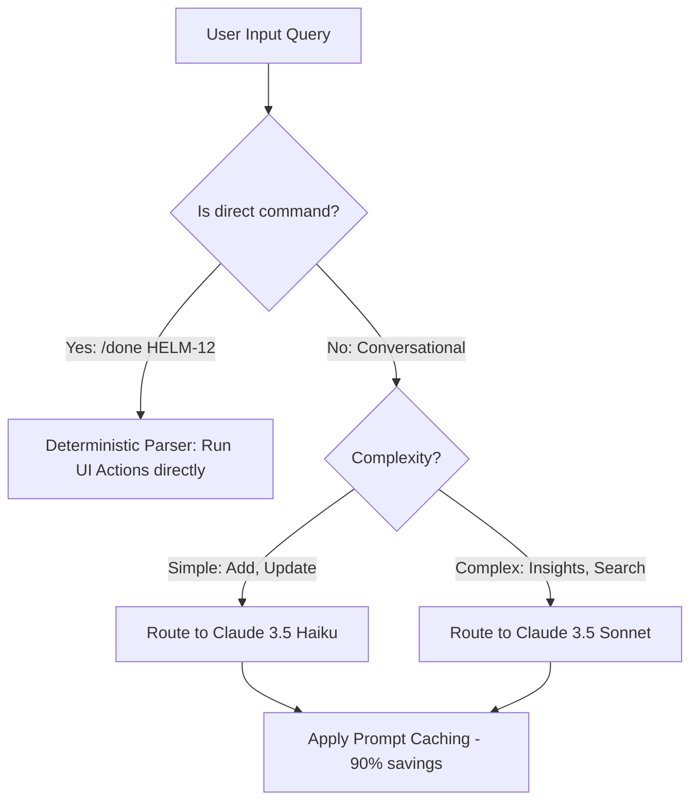
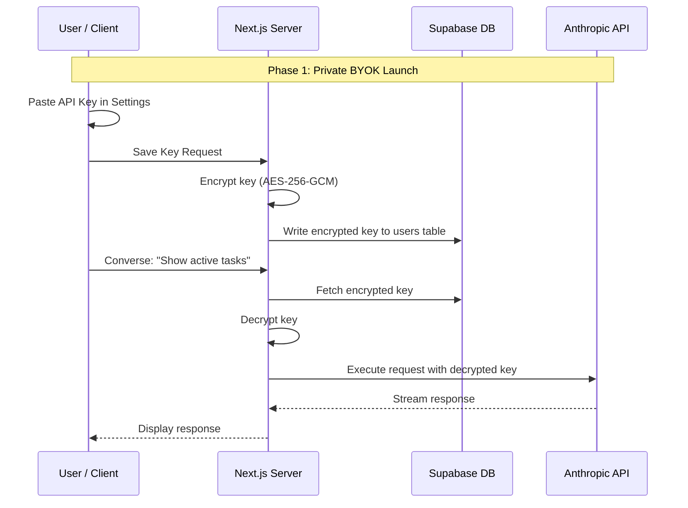

# Orb Monetization & AI Cost-Optimization Strategy

This document outlines a comprehensive plan to transition Orb from a single-owner subsidized app into a self-sustaining, profit-making product. It addresses the core economics of embedding large language models (Claude API), proposes monetization models, and lists concrete technical optimizations to reduce API expenses by 70% to 90%.

---

## 1. The Core Economics of the Orb App

As an AI-native productivity tool, Orb's largest variable cost is LLM API usage. The current conversational flow loads a rich database context into the prompt on every turn to ensure high-fidelity interactions.

### The Context Overhead
Every time a user asks a question or makes an update, Orb fetches:
*   Active and Parked backlogs across projects.
*   Recent items from the Knowledge Repository.
*   Recent entries from the Audit Trail.
*   User profiles and project metadata.

As a user's database grows, this context expands. A context that starts at 1,500 tokens can easily reach 5,000–8,000 tokens for active power users.

### Unit Cost Simulation (Without Optimizations)
Using **Claude 3.5 Sonnet / 4.5** ($3.00/M input, $15.00/M output tokens) for an active user making **20 queries a day** (600/month) with **5,000 tokens of context**:
*   **Monthly Input Cost:** 600 queries × 5,000 tokens = 3,000,000 input tokens = **$9.00**
*   **Monthly Output Cost:** 600 queries × 200 tokens (avg. response) = 120,000 output tokens = **$1.80**
*   **Total API Cost per User:** **$10.80/month**

At this rate, a standard SaaS pricing of $15/month yields a paper-thin margin after accounting for hosting, database, and transaction fees.

---

## 2. Technical Cost-Saving Optimizations

Before launching monetization, implementing the following four pillars will drastically reduce variable costs, allowing for healthy profit margins.

### Pillar A: Anthropic Prompt Caching (90% Savings)
Anthropic allows caching static system prompts and chat history. Because the system instructions and backlog context remain mostly static during a multi-turn chat session, caching is highly effective.
*   **How it works:** By marking blocks of the system prompt (e.g., instructions and backlog) with `cache_control: { type: 'ephemeral' }`, repeated queries read from the cache.
*   **Economics:** Caching drops the cost of cached input tokens from **$3.00/M to $0.30/M** for Sonnet.
*   **Impact:** Drops the monthly input token cost from $9.00 to **~$1.50/user**.

### Pillar B: Model Routing (Sonnet vs. Haiku)
Not all conversational turns require Sonnet's high intelligence. Simple mutations and queries can be routed to a cheaper, faster model.
*   **Routing Logic:**
    *   **Claude 3.5 Haiku ($0.80/M input, $4.00/M output):** Route simple commands (e.g., "Add a bug to Helm", "Mark task done", "Show active tasks").
    *   **Claude 3.5 Sonnet ($3.00/M input, $15.00/M output):** Route complex operations (e.g., knowledge base summaries, analytical insights, "why is Helm delayed?").
*   **Impact:** Cuts average conversational cost by **50%**.

### Pillar C: Context Truncation & RAG (Retrieval-Augmented Generation)
Instead of feeding the user's entire historical database into the prompt:
*   **How it works:** Implement text search (or vector embeddings via pgvector) on the backlog. For queries like "What's the status of the migration bug?", query the DB first and insert only the top 10 relevant items into the prompt.
*   **Impact:** Keeps prompt size small (under 1,500 tokens) regardless of how large the user's backlog grows over months of usage.

### Pillar D: Deterministic Fallbacks
Many operations entered in the input box are direct commands (e.g., `/done HELM-12`, `/project HELM`).
*   **How it works:** Parse inputs client-side using regex. If it matches a strict format, bypass the AI completely and perform a direct database mutation or client-side navigation.
*   **Impact:** 100% savings (zero API calls) for power-user command usage.

---

## 3. Monetization & Pricing Models

A hybrid approach maximizes user options and minimizes operational risk.

| Tier | Price | AI Access | Key Requirement | Target Audience |
| :--- | :--- | :--- | :--- | :--- |
| **Free / BYOK** | Free (or $3-5/mo for hosting) | Unlimited | User's own Anthropic Key | Developers, self-hosters, privacy advocates |
| **Pro Tier** | $12 - $19/month | Included (Soft-capped) | Hosted Key (Subsidized by Orb) | Non-technical users, team leads, business users |
| **Team Tier** | Custom pricing | Shared / Custom limits | Hosted Key | Organizations, agencies |

### The "Bring Your Own Key" (BYOK) Advantage
Offering a BYOK model has distinct advantages:
*   **Zero Risk:** Removes the risk of paying for high-volume users.
*   **Developer Friendly:** The tech-savvy target market for a task tracker usually prefers to control their AI usage and bills.
*   **Easy Entry:** Users can start with a cheap software fee without you worrying about pricing out your AI costs.

---

## 4. Key Storage Security Architecture (DB vs. Client-Side)

If BYOK is supported, storing keys securely in the database is superior to storing them in the browser's `localStorage` or cookies.

### Why Database Storage is Superior
1.  **Cross-Device Synchronization:** Since Orb has dedicated iPad and iPhone PWA views, a database-stored key is instantly active across all devices. Browser-bound storage requires manual copy-pasting on each client device.
2.  **Server-Side Execution & Background Tasks:** Next.js server actions run purely on the server. If keys are stored in `localStorage`, the client must send the raw key with every payload. More importantly, background tasks (like weekly email digests or notifications) cannot access browser storage. A database-stored key allows background tasks to operate autonomously on the user's behalf.
3.  **Security (Encryption at Rest):** Storing keys in browser storage leaves them vulnerable to XSS attacks (any third-party script can read plaintext local storage). Storing keys in the database encrypted with **AES-256-GCM** using a private, server-side secret key ensures they cannot be read or compromised.

### Encryption Standard (AES-256-GCM)
Keys are encrypted at the application level before database insert:
*   **Cipher:** `aes-256-gcm`
*   **Structure:** `iv` (Initialization Vector) + `ciphertext` + `tag` (Authentication Tag).
*   **Secret Key:** Derived from `process.env.ENCRYPTION_SECRET` (falling back to `process.env.ORB_API_SECRET` in development).

---

## 5. Transition & Launch Roadmap

### Step 1: Secure Key Storage Infrastructure
*   Run the database migration to add `anthropic_api_key` to the `users` table.
*   Add the application-level encryption/decryption module in `lib/crypto.ts`.
*   Build the settings UI card in `components/settings/SettingsAccount.tsx`.

### Step 2: Caching and Model Optimization
*   Refactor the system prompt in `app/actions/orb-converse.ts` to utilize prompt caching content blocks.
*   Integrate model routing, fallback to Claude 3.5 Haiku for task creation and updates, and save Sonnet for analytics/distillations.

### Step 3: Implement Context Truncation (RAG)
*   Modify query functions to pull only active, prioritized, or query-matching tasks into the prompt, reducing prompt tokens to a constant baseline of under 1,500.

### Step 4: Deterministic Slash Commands
*   Implement client-side regex matching to intercept direct commands (e.g., `/done`, `/add`) to completely bypass LLM API calls.
