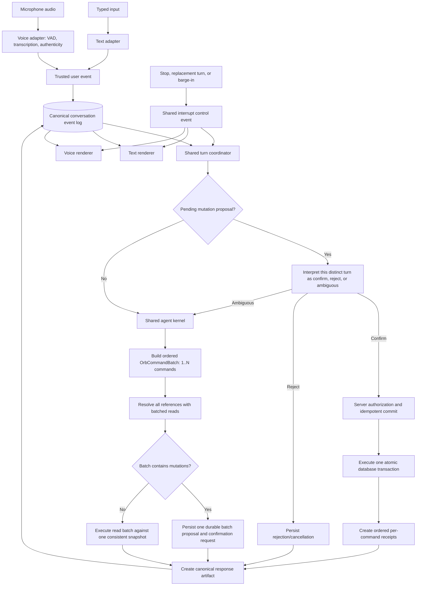

# Orb Unified Text and Voice Interaction Architecture Plan

**Status:** Shared interaction foundation and generic confirmation-gated mutation batching
implemented locally; migrations are applied; text is accepted; and the runtime is permanently
cut over to one shared text/voice kernel. Direct unified-voice acceptance remains pending.
**Date:** 2026-09-11
**Scope:** Orb conversation architecture for text and Realtime voice
**Companion artifact:** “Orb unified interaction flow — shared command-batch target” printable flowchart

## Objective

Make text and voice two transport adapters for one Orb interaction system. Once an utterance or typed request becomes a trusted user event, both modes must use the same conversation history, turn lifecycle, routing, model context, tools, authorization, operation handlers, response artifact, interruption semantics, and durable receipts.

The only intentional capability difference is slash commands, which are a text-interface convenience. A slash command that represents an Orb request may translate into a normal user event and rejoin the shared path. Interface-only commands such as `/help`, `/settings`, `/switch`, `/edit`, and `/clear` may remain local controls.

This architecture must make capability parity structural: adding or removing an Orb tool or operation must not require a voice-specific change.

The user turn is also the execution unit. Every accepted request becomes one ordered
`OrbCommandBatch`, whether it contains one command or many. This prevents the
single-command and multi-command paths from acquiring different resolution,
confirmation, transaction, interruption, or receipt behavior.

## Decisions

Stan approved the recommended defaults on 2026-09-11: durable per-user
conversation retention with soft-close `/clear`; no raw audio or hidden
reasoning; Realtime as a tool-disabled exact-text speech renderer;
server-durable cross-device history with per-client presentation
acknowledgement; latency acceptance after Phase 0 measurement; and an
incremental text → voice rollout. On 2026-09-15 Stan approved the permanent
runtime cutover while retaining the old Realtime agent prompt, tool schemas, and
client executor as dormant rollback assets.

On 2026-09-12, Stan also approved planning the generic command-batch correction:
single and multiple requests use the same FIFO batch path, references are resolved
in set-based reads, and confirmed mutations execute as one atomic database operation.

## Local Implementation Checkpoint

Phases 1–5 are implemented and the separate public text/voice rollout flags have
been removed. `app/actions/orb-converse.ts` is the single turn runner, with
shared types/store/rendering under `lib/orb-interaction/`. Stan applied and
verified both the conversation and generic command-batch migrations, and
accepted unified text locally. Unified voice is not yet accepted. Phase 0
latency/browser evidence therefore remains open. Phase 6
deletion of the disabled Realtime business prompt, schemas, client dispatcher,
and turn route is no longer planned: Stan directed that these remain available
as rollback code. They are compiled but unreachable in normal sessions because
Realtime transport-only mode is a permanent code contract rather than a
launcher setting.

The first direct unified-voice run on 2026-09-15 added three hardening rules:
explicit letter-by-letter/numeral spelling is preserved as exact tool context
without rewriting the durable transcript; a pending command batch remains
confirmable for 30 minutes across unrelated conversational detours; and the
provider's benign late-cancellation/no-active-response race is suppressed while
all other Realtime errors remain fatal and visible.

Exact-speech verification is interruption-aware. OpenAI emits its output-audio
transcript completion event for completed, interrupted, incomplete, and
cancelled responses. The voice adapter binds expected text to the event's
provider `response_id`; a trusted barge-in may therefore discard that response's
partial transcript without weakening exact-text enforcement for uninterrupted
responses or later speech.

**Revised 2026-09-16 (Stan approved):** the comparison uses
`comparableSpokenWords` (case, punctuation, quotes, hyphens, letter/digit joins,
and small number words ignored), and a remaining mismatch is recorded
(`speech_render_mismatch` telemetry mark, development-only text in the console)
rather than ending the voice session. The screen always shows the canonical
text. A stopped, replaced, or merged turn also rejects any proposal it stored,
because that proposal was never shown.

The implemented v0.6.316 slice makes one or many confirmation-gated mutations
share the same ordered envelope, resolves each required object class from one
bounded preparation snapshot, persists the batch in one RPC, and confirms all
children through one atomic RPC with an ordered aggregate receipt. Read-only
command batching, explicit inter-command result dependencies, and the durable
external-effect outbox remain later implementation phases and are not claimed
as complete.

1. **One conversation, not synchronized copies.** Text and voice append to one canonical, ordered conversation event log. Modality is metadata and cannot select a different history.
2. **One agent kernel.** Text and voice invoke the same server-owned turn runner and operation registry. Realtime is a speech transport, not a second Orb agent.
3. **One confirmation boundary.** Mutations are proposed by the shared kernel and committed by a deterministic coordinator only after a distinct later user turn confirms them. The request turn cannot confirm itself, even if it says “do it and consider it confirmed.”
4. **Confirmation is cross-modal.** A mutation requested by text may be confirmed by voice, and one requested by voice may be confirmed by text.
5. **Interrupt safety is shared, and only intent cancels.** Revised 2026-09-16 (Stan approved): a microphone hears wind, coughs, sirens, and other people, so sound is not intent. Acoustic barge-in only pauses Orb's speech and writes nothing; if the sound does not become trusted speech, the unfinished reply is spoken again. Only deliberate input — the Stop button, a bare stop word (typed or spoken), or a new request — records a durable interrupt, and of those only `stop` can block a confirmed commit that has not run. The same rules apply to text and voice (`lib/orb-interaction/interrupt-intent.ts`).
6. **Committed effects survive interruption.** Interrupting cancels uncommitted work and current presentation. It does not roll back a committed mutation, delete a pending proposal, or suppress its durable receipt. The client keeps reading a stopped or replaced turn so a receipt that arrives afterwards is still shown (silently) and applied to the project and todo lists.
10. **Only the server writes proposals and receipts.** Added 2026-09-16 after four voice project requests got a model-written "I'm about to create… Want me to go ahead?" with no stored proposal, and two confirmations got a model-written "Created the project…" with no receipt. Model history labels server-issued proposals, database receipts, and unbacked claims; the shared false-claim gate retries once and then replaces — never delivers — a completion claim with no receipt or a go-ahead question with no proposal stored in that request (a different pending batch does not count; the stored batch is restated verbatim instead). A confirmation commits only if the last go-ahead the user saw is the stored batch's own wording; otherwise the server restates the stored batch and records a `mutation_proposed` restatement event, so the next confirmation approves exactly what was shown.
7. **Only canonical visible events enter history.** Raw reasoning, provider events, partial transcripts, tool JSON, stale deltas, and speech-recognition hints never become conversation messages.
8. **One response artifact feeds both renderers.** The UI renders its canonical Markdown; voice speaks its canonical `spokenText`. Neither adapter independently rewrites the answer or invokes business tools.
9. **Every turn is one ordered command batch.** One request produces a one-item batch; several requests produce one FIFO batch. Reads are resolved together and writes are committed together, never by independently executing tool handlers.
10. **One confirmation covers the displayed mutation batch.** A later confirmation authorizes exactly the durable batch the user saw. Confirmation executes one atomic, replay-safe transaction and returns an ordered receipt for every command.

## Target Flow



Green “shared process” blocks in the printable flowchart correspond to the path from trusted user event through the canonical log, coordinator, agent kernel, command-batch planner/resolver, commit gate, receipts, and response artifact. Only capture and rendering remain mode-specific.

## Verified Current-State Gaps

The following findings are based on reading the current code paths, not assumptions.

### Conversation history is visually merged but semantically split

- `components/UnifiedDashboard.tsx` owns visible `ConversationMessage[]` state and persists it in `sessionStorage` under `todos_orb_conversation`.
- Text submits a client-built projection of those messages to `app/actions/orb-converse.ts`.
- `app/api/orb-realtime/session/route.ts` creates an independent OpenAI Realtime session without seeding the existing conversation.
- Voice transcripts are appended to the same visible list, but the Realtime model knows only the history inside its own live session. The interface therefore appears unified while the model histories are not.

### The voice path duplicates the agent path

- Serial tool definitions originate in `lib/orb-contract.ts` and are consumed by `app/actions/orb-converse.ts`.
- Realtime tool schemas are duplicated inline in `app/api/orb-realtime/session/route.ts`.
- `lib/hooks/useRealtimeVoiceSpike.ts` maps Realtime tool calls to another large request shape.
- `app/api/orb-realtime/turn/route.ts` contains another operation switch for reads, actions, proposals, and confirmation.
- Some operation execution has converged under `lib/orb-operations/`, but prompts, tool exposure, routing, history, and outer orchestration remain duplicated.

### Stop and barge-in do not share semantics

- Text Stop marks the active client request aborted and ignores later stream chunks; it stops UI streaming and speech but does not cancel server/model/tool work.
- Realtime uses provider barge-in, turn IDs, and abort controllers for most calls.
- Confirmation calls are deliberately non-abortable, but the client can discard their returned receipt when its turn ID is no longer active.

### “Ghost” content can reach the visible transcript

- `components/OrbConversation.tsx` renders `msg.thoughts` above Orb Markdown.
- The serial path persists streamed `thought` chunks into that field.
- Realtime completed transcript events are appended directly as visible user or Orb messages without passing through a typed visibility policy.
- A non-empty transcript alone is not proof that the user spoke it; the existing STT hint can be echoed as a phantom transcript.

### Confirmation is durable but still channel-partitioned

- `lib/orb-operations/proposals.ts` and `lib/orb-operations/confirmation.ts` provide a useful canonical proposal and idempotent transactional commit spine.
- `lib/orb-mutations.ts` explicitly queries, deletes, and stores pending serial proposals using `channel = 'serial'`.
- The proposal table and index also model a pending proposal by channel. This prevents confirmation from being truly cross-modal.
- Serial checks for a pending proposal before ordinary model handling. Realtime relies on the Realtime model to call a confirmation tool before the server rechecks it. These are different authorization paths.
- The Knowledge Repository confirms that every exposed create, update, delete, move, and close already requires a separate second confirmation turn. This plan preserves that accepted safety contract; it changes where the confirmation is recognized so both modes use the same deterministic coordinator.
- The Knowledge Repository also confirms that the canonical transaction is already transport-neutral at the database boundary, while outer query adapters, provider-facing schemas, and interaction shapes remain channel-specific. Those remaining differences are the convergence target, not a reason to replace the proven transaction.

### Multiple tool calls are not one generic batch

- The reproduced request to delete three projects produced three `delete_project`
  tool calls and displayed all three targets, but only the last project was deleted
  after confirmation.
- `storePendingMutation` removes the prior pending serial proposal before inserting
  the next one. Several independent mutation tool calls in one model turn therefore
  collapse to the last proposal even though the user was shown the whole set.
- Todos have a specialized `batch_todo_action`, while projects, Knowledge actions,
  and other tools do not share a generic batch envelope. A delete-only repair would
  preserve the architectural defect.
- Independent tool handlers also permit N application-to-database round trips for N
  commands. The target is set-based resolution plus one batch execution boundary for
  every domain, not a loop hidden behind a batch-shaped API.
- A LIFO stack is incorrect because visible request order is meaningful. The
  canonical structure must be an ordered FIFO command list with explicit dependency
  edges when a later command uses an earlier command's result.

## Proposed Components

Names below are proposed boundaries, not mandatory filenames. Implementation may adjust names while preserving responsibilities.

### 1. Canonical conversation store

Add durable, user-owned conversation storage. Recommended tables:

#### `orb_conversations`

- `id`
- `user_id`
- lifecycle/status fields
- optional current context metadata
- `created_at`, `updated_at`, and soft-close timestamp

#### `orb_conversation_events`

- immutable `event_id`
- `conversation_id`
- monotonic `sequence`
- `turn_id`
- `actor`
- typed `event_type`
- input modality as metadata
- visibility classification
- canonical payload
- optional `proposal_id`, `operation_id`, or `response_id`
- `created_at`

Required properties:

- Unique event IDs and idempotent append.
- Ordered reads by `(conversation_id, sequence)`.
- Explicit authorization by authenticated user ownership.
- Append only accepted user turns, canonical assistant responses, control events needed for recovery, proposals, and receipts—not tokens or partial deltas.
- No raw audio, provider payloads, hidden reasoning, or raw tool arguments in the user-visible projection.
- No broad `postgres_changes` subscription. Load and append explicitly to control ordering and cost.

Recommended `/clear` behavior: soft-close the active conversation and create a new one. This preserves audit integrity while giving the user a clean context. Retention and deletion policy must be approved before schema implementation.

### 2. Shared interaction types and projections

Introduce typed contracts under a boundary such as `lib/orb-interaction/`:

- `types.ts` — `ConversationEvent`, `UserTurn`, `InterruptTurn`, `MutationProposal`, `MutationReceipt`, `OrbResponseArtifact`.
- `conversation-store.ts` — append, load, acknowledge, and close operations.
- `context.ts` — one transport-neutral projection from canonical events to model messages.
- `response-artifact.ts` — validates what may be rendered, spoken, and persisted.

The canonical log may be complete while the model projection is bounded. If context limits require compaction, compaction must be identical for both modes, explicitly tested, and preserve proposal, authorization, operation, and receipt facts. Modality must never influence what history is included.

### 3. Shared command-batch coordinator

Introduce a transport-neutral `OrbCommandBatch` as the only route from the agent
kernel to data operations:

- `batchId`, `conversationId`, source `turnId`, authenticated `userId`, and lifecycle state.
- An ordered list of one or more typed command descriptors. A single command is represented by one item; it does not bypass the batch path.
- Stable `commandId` and zero-based sequence for every item.
- Optional references to results from earlier commands, with backward-only dependency validation and cycle rejection.
- Resolved target IDs, authorization facts, and optimistic-lock versions captured during preparation.
- An ordered per-command result/receipt collection plus one aggregate batch outcome.

The model-facing tools are planners only: they contribute descriptors to the active
turn batch and never independently query, persist a proposal, or mutate a domain
table. After the model/tool loop ends, the coordinator prepares the whole batch:

1. Validate every descriptor against the canonical operation registry.
2. Collect all human references before querying.
3. Resolve references with set-based reads—one database call where practical, or at
   most one query per object class—not one call per command.
4. Reject the whole batch before execution if any target is missing, ambiguous,
   unauthorized, cyclic, or otherwise invalid.
5. Execute read-only commands against one consistent snapshot.
6. Persist mutation commands as one durable proposal for a later confirmation turn.

For a mixed read/write turn, the read subset may return verified results immediately,
while the write subset remains one ordered proposal. The proposal must preserve the
relationship between both subsets so the final response cannot imply that proposed
writes already occurred.

Recommended persistence boundary:

- `orb_command_batches` stores ownership, conversation/turn provenance, state,
  idempotency, authorization, aggregate outcome, and timestamps.
- `orb_command_batch_items` stores sequence, canonical kind, normalized parameters,
  resolved references, dependencies, expected versions, and per-command receipts.
- A preparation RPC accepts the normalized batch and resolves/validates it set-wise.
- A confirmation RPC locks the batch, rechecks every item, performs all database
  writes in request order inside one transaction, and stores the complete receipt.

External effects such as email or push notification cannot participate safely in the
database transaction. Write durable outbox records in that same transaction, then
deliver them after commit with idempotent consumers.

### 4. Shared server turn runner

Create one server-owned entry point, for example `runOrbTurn`, responsible for:

1. Authenticating the user and conversation.
2. Idempotently appending the trusted user event.
3. Checking the conversation for a pending mutation proposal before invoking any model.
4. Resolving a distinct-turn confirmation, rejection, or ambiguity deterministically.
5. Building the common history projection.
6. Running the same routing/model/tool loop for all modes.
7. Building one ordered `OrbCommandBatch` from all tool calls in the turn.
8. Sending that batch once to the shared batch coordinator for preparation or execution.
9. Persisting proposals, committed effects, receipts, and one final response artifact.
10. Returning or streaming typed presentation events.

Both interfaces should use one authenticated endpoint such as `app/api/orb-interaction/turn/route.ts`. `app/actions/orb-converse.ts` may temporarily remain as a thin compatibility wrapper around the same runner. The architectural rule is one implementation, not necessarily one HTTP mechanism during migration.

### 5. Shared confirmation and commit gate

The turn coordinator—not the model and not the input adapter—owns confirmation.

Rules:

- A mutation request creates one durable batch proposal and a confirmation request; it never commits in that same turn.
- Only a later trusted user event can authorize the proposal.
- “Do it and consider this confirmed” is still the request turn and must only produce a proposal.
- Pending lookup is scoped to authenticated user plus conversation, not modality/channel.
- The confirming event is bound to batch/proposal ID, event ID, and turn ID before commit.
- Server-side authorization and an idempotency key are required at the transaction boundary.
- A repeated confirmation returns the existing aggregate and per-command receipts and cannot execute twice.
- Reject/cancel closes the proposal without executing it.
- Ambiguous language proceeds through the shared kernel for clarification and never silently commits.
- `channel` becomes diagnostic `origin_modality` metadata only; it cannot participate in authorization or pending selection.

This requires revising the proposal schema/index and the channel filters in `lib/orb-mutations.ts`. The useful transactional RPC and durable receipt behavior in `lib/orb-operations/confirmation.ts` should be retained and generalized from specialized mutation kinds to the canonical command batch. If any item is stale or fails, the transaction rolls back every item; partial success is never reported.

### 6. Shared interrupt coordinator and durable delivery

Introduce one client interaction controller, likely a hook such as `useOrbInteraction`, that owns:

- active `turnId`
- lifecycle state
- cancellation token/abort controller
- renderer acknowledgements
- pending output/playback
- reconnect recovery

**Revised interrupt contract (2026-09-16, Stan approved).** Interruption has two kinds:

| Kind | Raised by | Effect |
|---|---|---|
| Pause speech | Sound alone: Silero real-start or provider VAD during rendering | Cancels the current audio render only. Nothing durable, no request aborted, no commit blocked. Untrusted, empty, or failed transcription resumes the paused reply. |
| Cancel turn | Stop button or bare stop word → `stop` (the stop word itself is not sent as a turn); new input before the running turn has shown any reply → `merge` (the fragments are submitted as one combined turn and the fragment is hidden from history); any other new text/voice request → `replacement`; leaving voice → `exit_voice` (silences only) | `stop`/`replacement` record a durable interrupt for the in-flight turn and end its presentation. Only `stop` blocks `confirm_orb_command_batch` / `confirm_orb_mutation` (`20260916_orb_intentional_interrupts.sql`). A finished turn is never interrupted. |

Interrupt behavior for `stop` and `replacement`:

- Cancel uncommitted model and read-only tool work where cancellation is supported.
- Stop current text streaming and audio playback promptly.
- Ignore stale presentation deltas by typed turn/event ID.
- Do not abort a commit after the transaction boundary has begun.
- Before commit begins, a `stop` cancels the entire prepared batch; it never pops or executes a subset. A `replacement` lets an already-confirmed commit finish.
- Do not delete pending proposals.
- Persist the result/receipt independently of whether the originating renderer is still active.
- Redeliver an unacknowledged committed response or receipt once after reconnect or on the next interaction.
- Carry database-issued project rows and refresh scopes inside the durable response artifact. Every client projects those committed rows into its project collections before acknowledging delivery, then reconciles with a normal read; capture modality never participates in refresh behavior.

This separates **execution truth** from **presentation state**. A client-side turn mismatch may hide stale prose, but it may never erase the authoritative outcome of a write.

### 7. Canonical response artifact and visibility gate

Define an `OrbResponseArtifact` containing at least:

- `responseId` and source `turnId`
- canonical Markdown for the text renderer
- canonical `spokenText` for the voice renderer
- typed actions and refresh metadata
- proposal or receipt linkage
- visibility classification

Only validated visible artifacts become assistant conversation events. `components/OrbConversation.tsx` should render those typed events and stop rendering stored `thoughts`.

If progress indication remains useful, it must be ephemeral, intentionally authored status outside conversation history. Raw chain-of-thought, provider reasoning, partial transcripts, tool JSON, and stale deltas are never valid display content.

Free-text deduplication should be replaced by `eventId`/`responseId` acknowledgement. Both text and voice presentation consume the same committed response event.

### 8. Text adapter

Refactor `components/UnifiedDashboard.tsx` so that:

- Slash-command interception remains the only text-specific capability layer.
- Non-slash text creates the same trusted user event as voice.
- The client stops constructing and sending its own authoritative history array.
- `sessionStorage` becomes an optional cache during migration, then is removed as the source of truth.
- Stop and replacement turns emit the shared interrupt control.
- Rendering subscribes to canonical events/response artifacts.

### 9. Voice adapter

Replace the experimental `useRealtimeVoiceSpike.ts` boundary with a production speech adapter. It should own only:

- microphone/audio capture
- VAD and barge-in detection
- transcription
- transcript authenticity checks
- exact response speech playback
- connection lifecycle

On an authenticated completed transcript, it submits the same trusted user event to the shared turn runner. The spoken response comes from the committed artifact’s `spokenText`.

The Realtime provider must no longer have Orb’s business prompt or tools. It may render exact supplied speech with tools disabled, or be replaced with deterministic TTS. It must not independently reason, select tools, confirm mutations, or author a second answer.

After cutover, delete:

- duplicate inline Realtime business tool schemas and prompt rules
- the large client `executeToolCall` mapping
- the duplicated `app/api/orb-realtime/turn/route.ts` operation switch
- obsolete Realtime-only proposal/confirmation routing

### 10. Transcript authenticity boundary

Before voice text becomes a canonical user event, require evidence that it came from user audio. Use the provider item identity plus acoustic evidence such as useful log probabilities and/or a local speech detector such as Silero. A non-empty transcript is insufficient.

Do not persist transcription hints, empty/low-confidence turns, or provider-generated echoes. Until this rejection boundary is implemented, do not narrow the current STT prompt in a way that could make its text easier to echo. Removing the hint is safer than making it more command-like, subject to measured transcription quality.

## Implementation Sequence

### Phase 0 — Characterization and contracts

- Add deterministic characterization coverage for current text history, Realtime session isolation, stop behavior, proposal persistence, receipt delivery, and visibility.
- Reproduce and preserve evidence for single-command, multi-command, mixed-domain, and dependent-command behavior, including the current last-proposal-wins defect.
- Define the canonical event, turn, command-batch, response, confirmation, and interruption types.
- Record latency and current time-to-first-text/time-to-first-audio baselines.
- Update the architecture plan if code evidence contradicts any proposed boundary.

### Phase 1 — Canonical event log

- Add the conversation/event migration with ownership policies and minimal justified indexes.
- Implement append/load/close/idempotency APIs.
- Load the UI from canonical events while retaining session storage only as a temporary cache.
- Preserve current behavior before changing model routing.

### Phase 2 — Extract and migrate the shared kernel

- Extract `runOrbTurn`, common context projection, response artifact validation, and the contract-backed operation registry.
- Make every tool handler return a command descriptor; remove independent database execution from the tool loop.
- Add the one-item-or-many `OrbCommandBatch` envelope and set-based preparation boundary.
- Make the existing text action/endpoint a thin adapter.
- Migrate text first and prove no behavior regression.

### Phase 3 — Unify command batches and confirmation

- Move pending-proposal interception ahead of provider/model invocation.
- Change proposal scope from user+channel to user+conversation.
- Persist every mutation set as one ordered batch proposal, including a single mutation.
- Replace specialized todo batching and last-proposal-wins project/Knowledge persistence with the generic coordinator.
- Execute confirmation through one atomic batch RPC with stale checks, replay protection, and complete ordered receipts.
- Add a transactional outbox for external effects produced by committed commands.
- Enforce distinct-turn confirmation and bind the confirming event.
- Preserve the existing idempotent commit and durable receipt guarantees while generalizing their shape.
- Add cross-modal confirmation tests before switching voice.

### Phase 4 — Convert Realtime to speech transport

- Remove Orb reasoning and business tools from the Realtime session.
- Submit authentic completed transcripts to the shared runner.
- Speak the shared artifact’s exact `spokenText`.
- Delete the duplicate client tool mapping and Realtime turn operation switch after parity is demonstrated.

### Phase 5 — Interrupt safety, outbox, and ghost-text gate

- Introduce the shared client lifecycle/interrupt controller.
- Separate execution cancellation from presentation cancellation.
- Add durable response/receipt acknowledgement and recovery.
- Enforce the visibility gate and remove persisted/rendered thoughts.
- Add acoustic transcript validation and phantom-transcript rejection.

### Phase 6 — Cutover and cleanup

- Remove session storage as conversation authority.
- Remove obsolete Realtime schemas, prompts, callbacks, request types, and routes.
- Update `docs/object-capability-matrix.md` and supersede contradictory text in older voice/convergence plans.
- Update `docs/ui-catalog.md` only if an established UI pattern changes.
- Complete release documentation, version bump, handoff, and required verification only when Stan authorizes implementation and release work.

## Files Expected to Change During Implementation

This inventory is directional; exact migrations and test filenames should be chosen after Phase 0.

### Shared architecture

- New `lib/orb-interaction/*` modules
- New shared command-batch types, planner, resolver, and coordinator
- `lib/orb-contract.ts`
- `lib/orb-operations/*`
- `lib/orb-mutations.ts`
- New authenticated shared turn/history route or action

### Text and common UI

- `components/UnifiedDashboard.tsx`
- `components/OrbConversation.tsx`
- New shared interaction hook/controller
- Existing serial streaming action reduced to an adapter

### Voice

- `lib/hooks/useRealtimeVoiceSpike.ts` replaced or renamed
- `app/api/orb-realtime/session/route.ts` reduced to speech configuration
- `app/api/orb-realtime/turn/route.ts` deleted after cutover
- Realtime-specific tool-call types and callbacks removed

### Data, tests, and documentation

- New Supabase migration under `scripts/migrations/` for canonical command batches, ordered items, atomic prepare/confirm RPCs, and any required outbox table
- `scripts/eval-cases.ts`
- deterministic unit/integration tests for the shared coordinator and store
- `docs/object-capability-matrix.md`
- obsolete statements in `docs/orb-342-operation-convergence-plan.md`, `docs/orb-359-realtime-confirmation-integrity-plan.md`, and related voice plans
- `docs/ui-catalog.md` only if needed
- release files when a production release is authorized: `lib/changelog.ts`, `package.json`, and `lib/version.ts`

## Verification Plan

### Deterministic coverage

- Event ordering, idempotent append, ownership, pagination, and projection.
- Alternating text/voice turns produce one ordered context.
- Text request → voice confirmation and voice request → text confirmation.
- A mutation cannot be confirmed in its request turn.
- Duplicate confirmation executes once and returns the same receipt.
- Interruption before commit cancels work; interruption during/after commit preserves and redelivers the receipt.
- Stale deltas cannot enter history.
- Raw reasoning, partial transcripts, hints, and tool payloads fail the visibility validator.
- One contract/operation registry serves both adapters; a guard test rejects duplicate Realtime business schemas.
- One requested command and many requested commands traverse the same coordinator.
- Multiple todo, project, Knowledge, and mixed-domain references are resolved in batched reads rather than one application query per item.
- A three-project delete produces one proposal and either three committed receipts or a total rollback—never last-item-only success.
- Mixed read/write turns return verified read results while preserving the entire write subset for confirmation.
- Later commands may consume earlier command results; forward references, cycles, missing dependencies, and ambiguous targets fail closed.
- Any stale or failed command rolls back the complete mutation batch.
- Duplicate confirmation returns the same complete ordered receipt with no repeated writes.
- `stop` before commit cancels the whole batch; `replacement`, `exit_voice`, and acoustic barge-in never do; interrupt during/after commit preserves the authoritative receipt.
- Untrusted sound during playback resumes the paused reply and creates no user turn.
- External side effects are emitted once from the committed outbox, never from a partially executed tool loop.
- Instrumented assertions reject N per-item database calls for a batch-capable resolution or execution path.

### Repository checks

- `npx tsc --noEmit`
- ESLint on changed files
- `npm run generate-contract`
- `git diff --check`
- migration verification/rollback where applicable
- `node scripts/verify-handoff.js` when the handoff is updated

Before implementing Next.js route or server-action changes, read the applicable guides in `node_modules/next/dist/docs/` because this repository’s Next.js version is not assumed to match prior conventions.

### Orb evals

Every changed conversation capability or policy requires matching categorized coverage in `scripts/eval-cases.ts` in the same change. The AI must not run model evals.

Because this plan changes global history/context assembly, routing, mutation authorization, and model request construction, Stan’s required model gate must run through Orb’s encrypted-runtime launcher:

```bash
orb-dev --eval-t1
```

Affected Tier 2 speech/policy cases must also run through the launcher:

```bash
orb-dev --eval-t2
```

Arguments selecting cases, categories, or suites are passed after the launcher mode. Tier 2 cases must be run three times per case. The launcher supplies the encrypted runtime required by the eval suite; do not invoke `npm run eval:t1` or `npm run eval:t2` directly. Realtime changes also require the documented direct Realtime schema/route/RPC verification and representative DEV acceptance; serial analogue cases do not prove Realtime behavior.

### Manual acceptance matrix

Test representative flows on Safari, Chrome, and Edge where available, plus Mac, iPad, and iPhone:

- mixed-mode pronoun/follow-up context
- text request → voice confirm
- voice request → text confirm
- same-turn “consider it confirmed” refusal
- stop before model response
- barge-in during speech
- stop during a slow read
- interrupt around a mutation commit
- disconnect/reconnect before receipt presentation
- no duplicate answers or receipts
- no ghost text or phantom user turns
- one-command request parity with the pre-batch user experience
- several reads in one request with complete, ordered results
- several mutations in one request with one confirmation and complete receipts
- mixed-domain and dependent commands in request order
- one invalid/stale item causing total rollback with a precise explanation

## Acceptance Gates

Implementation is complete only when all of the following are true:

1. The capability matrix is identical for text and voice except documented slash commands.
2. Alternating modes produces indistinguishable shared context and follow-up behavior.
3. Adding/removing an Orb tool requires changes only to the canonical contract/handler and its evals—not voice code.
4. Same-turn mutation confirmation is rejected; a distinct later turn from either mode can confirm exactly once.
5. No committed receipt is lost or duplicated across interruption, replacement turns, reconnects, or renderer changes.
6. Stop behavior cancels uncommitted work while preserving committed effects and their receipts.
7. No private reasoning, partial transcript, provider event, raw tool payload, stale delta, or transcription hint appears in conversation history.
8. Realtime contains no Orb business prompt, operation routing, or business tool schema.
9. Added persistence does not create a token/delta write path or a broad database subscription.
10. Latency remains within an explicitly accepted budget measured against the Phase 0 baseline.
11. Every turn uses the same ordered command-batch abstraction for one or many commands; there is no single-command bypass.
12. Multiple command references are resolved set-wise and confirmed mutations execute in one atomic database transaction, not N client-driven calls.
13. A batch never degrades to last-item-only or partial success; its receipt accounts for every command in request order.

## Approved Decisions

Stan approved the first five decisions on 2026-09-11 and the command-batch decision
on 2026-09-12:

1. Durable per-user conversations; `/clear` soft-closes the current conversation and starts another. No raw audio or hidden reasoning is stored.
2. Realtime is an exact-text speech renderer with tools disabled.
3. Event history is server-durable across devices; per-client acknowledgement is presentation recovery only.
4. The maximum added persistence/coordinator latency will be accepted after the instrumented Phase 0 measurements.
5. Rollout is staged: text first, then voice, then deletion of the disabled duplicate Realtime agent path.
6. Every user turn uses one ordered command batch for one or many commands. Resolution is batched, and confirmed mutations commit atomically with complete ordered receipts.

## Risk Controls

- Treat this as a high-risk conversation-surface refactor on a short-lived `codex/` branch with an active `ACTIVE_WORK/` claim.
- Use small phase commits; do not combine the persistence foundation, voice cutover, and cleanup into one irreversible step.
- Apply database migrations through Stan’s approved database workflow; agents do not perform direct database writes.
- Preserve the old adapter only as a temporary rollback path. Do not allow it to become a permanent second kernel.
- Measure nondeterministic behavior at least three times before describing it as fixed.
- Update the handoff with exact verification results and uncertainty; a single pass must be reported as one pass.

## Knowledge Repository Review

The initial broker call failed because the managed agent sandbox blocked DNS socket access. An unrestricted DNS check verified that the configured Supabase pooler hostname resolves normally, and `orb-agent status` then verified that the standing `orb_agent_ro.livwkbnkdlrbmzgythys` credential is accepted with SELECT-only access.

The task-start search was repeated successfully. The exact multi-term search returned no rows, so broader relevant searches were used. The following records were read and incorporated:

- **“Orb Voice command safety, database parity, and complete todo field access”** (`e93b1578-0741-4da5-8ca2-b515952bca4a`) — confirms the accepted separate-second-turn rule, shared presentation work, complete todo fact shape, and the remaining channel-specific outer adapters.
- **“ORB-342 resolved: text and voice share one canonical mutation transaction”** (`7a0f52c3-7490-45e6-a984-af4b14c70f96`) — confirms the server-held proposal, row-locked idempotent commit, and replay-safe receipt as the durable boundary to preserve.

ORB-342 intentionally allowed different provider-facing schemas and interaction shapes. The present plan supersedes that allowance because the new requirement is stronger: future operation additions and removals must not require changes to either input path. Provider-specific speech mechanics may remain, but business schemas, routing, authorization, and operations must reside exclusively in the shared kernel.
