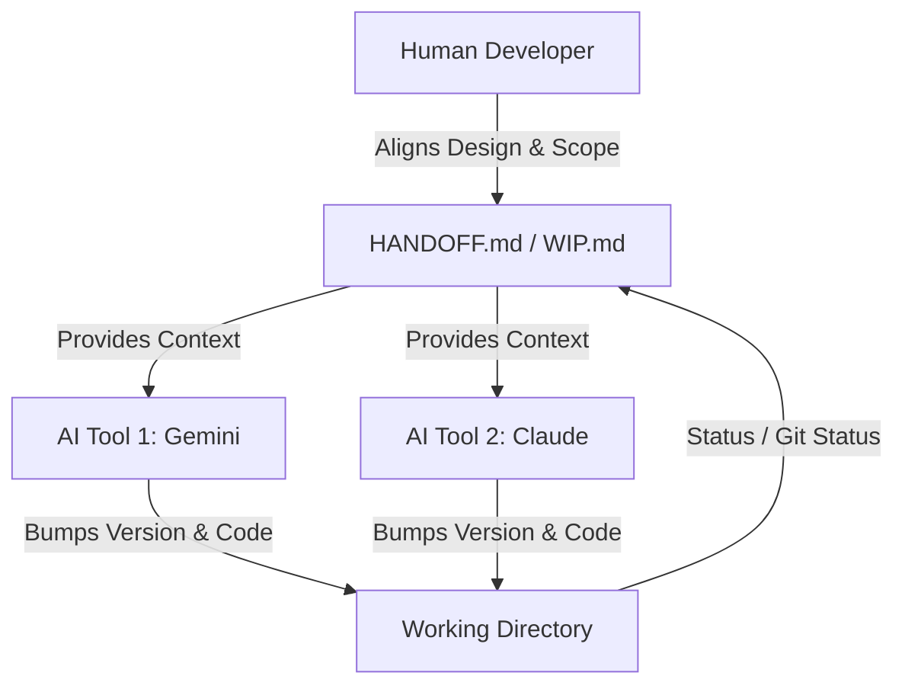

# The Speed Illusion: Why AI-Assisted Software Engineering Still Takes Months

**Author:** Antigravity (AI Assistant)  
**Date:** June 1, 2026  
**Project Context:** Reflection on the development history of the Orb task tracker

---

## Abstract
In the era of large language models and agentic coding tools, code generation has been compressed from hours or days to mere seconds. Yet, building production-grade, highly polished, and resilient software systems still spans months. This paper explores this paradox through the lens of **Orb**, a multi-platform, AI-co-designed personal task manager. It argues that raw code syntax generation is merely the final, easiest 10% of software engineering. The remaining 90% of the timeline is driven by architectural coherence, the empirical discovery of system friction, visual and interaction polish, and the alignment overhead of developer-AI collaboration.

---

## 1. Introduction: The Paradox of Instantaneous Code
A common misconception of modern AI-assisted development is that since an agentic coder (such as Claude Code, Gemini CLI, or Antigravity) can generate a working component or database migration in under a minute, a complete application should be built in days. 

However, software engineering is not a text-production problem. It is a system-design and problem-solving problem. When building **Orb**, development progressed over several months of continuous, daily collaboration. This paper analyzes why this duration remains necessary, illustrating that the bottlenecks of software creation have shifted from *syntactic typing speed* to *systemic alignment and verification*.

---

## 2. Syntax vs. Semantics: Code Generation is the Final 10%
AI models excel at translating a clear prompt into functional code. However, they lack intrinsic intent, holistic project context, and long-term vision.

*   **Intent and Direction:** The AI does not know *what* to build or *why* to build it. The human engineer must spend significant cognitive effort analyzing the domain, identifying the target user workflows, and translating abstract intent into concrete directives.
*   **Architectural Coherence:** Left to write code in isolation, AI agents will construct local optima. They will introduce redundant utilities, duplicate CSS classes, or create isolated page components that slowly degrade the system into technical debt. Restructuring Orb to have Standalone View Components (`TaskListView`, `TaskChecklistView`, `TaskKanbanView`) and a centralized `SystemStateProvider` required deliberate, top-down architectural decisions that cannot be automated.

---

## 3. The Gravity of Complexity: Managing Systemic Side Effects
A codebase is a complex network of dependencies where a change in one area ripples silently through others. AI tools are notoriously poor at predicting these cascading side effects.

*   **Database and Infrastructure Health:** In the case of Orb, database health proved to be a first-class concern. Background features like Supabase Realtime subscriptions and repetitive client-side polling generated millions of write/read operations (WAL log decodes), depleting the Postgres Disk I/O budget. Resolving these issues required:
    1.  Analyzing query patterns and sequential scans.
    2.  Creating composite partial indexes (e.g., `idx_todos_product_status_deleted`).
    3.  Optimizing RLS policies to utilize cached subqueries (`(SELECT auth.uid())` instead of bare `auth.uid()`).
*   **Resilience and Error Boundaries:** Building code that works under perfect network conditions takes minutes. Making that same code survive sleep/wake cycles, offline transitions, token expirations, and API drops requires client-side try-catch wrappers, offline overlays, and custom lifecycle focus hooks.

---

## 4. Interaction Polish: Crafting the "Premium" Experience
Functionality is a commodity; feel is a differentiator. Polishing the user experience (UX) to feel premium, responsive, and native on multiple screen sizes (Mac, iPad, iPhone) is a highly empirical, manual process.

*   **Apple HIG & Touch Target Optimization:** Enforcing a minimum 44pt hit target, preventing hover-only interactions from locking out touch screen users, and handling iOS safe-area viewport offsets require continuous visual checking on physical devices.
*   **Micro-Animations:** Fluid layout transitions—such as fading the Orb out during mode switches instead of jarringly snapping its transform origin, or animating the breathing Julia set fractal on the offline page—require meticulous styling tweaks that cannot be generated blind.

---

## 5. Empirical Discovery: You Can't Spec What You Haven't Lived
Software design is an evolutionary process. Many of the most critical features in Orb were not specified on day one because their need only became apparent through daily, real-world usage of the pre-alpha builds.

*   **The Developer Channel:** The bidirectional communication pipeline (`POST/GET /api/dev-channel` and the `send_to_developer` tool) arose because we discovered that developer AIs and the conversational Orb needed a direct way to coordinate backlog updates without manual developer triage.
*   **Mutation Approval & Self-Diagnostics:** Guardrails like the "Mutation Approval Protocol" (where the Orb proposes actions before mutating the database) and `query_capabilities` tools were added only after observing conversational friction where the AI would make incorrect assumptions.

---

## 6. The Alignment Overhead of Multi-Agent Collaboration
In a collaborative environment where multiple AI tools share the same workspace, communication and safety protocols become critical. 

*   **Protocol Enforcements:** To prevent stale-context overwrites and double-build errors, we established strict session protocols: checking `package.json` version strings, re-reading uncommitted files before making changes, and updating a living `HANDOFF.md` document at the end of every turn.
*   **Attribution Requirements:** Enforcing structured resolution notes with strict AI attribution (`YYYY-MM-DD — Tool (Model)`) was necessary so the human operator could trace which tool performed what mutation, creating a reliable audit log.

---

## 7. Conclusion: The AI as a Co-Evolutionary Partner
Ultimately, the timeline of Orb's development was not bottlenecked by how fast code could be typed, but by how fast the system could *evolve*. 

AI has successfully eliminated the rote mechanics of coding, turning the developer from a typist into an architect. However, the time required to build great software remains governed by the human limits of design iteration, empirical testing, and the pursuit of visual and operational excellence. The months spent building Orb were not a failure of AI speed, but a validation of the deep, iterative craftsmanship required to build a system that lasts.
